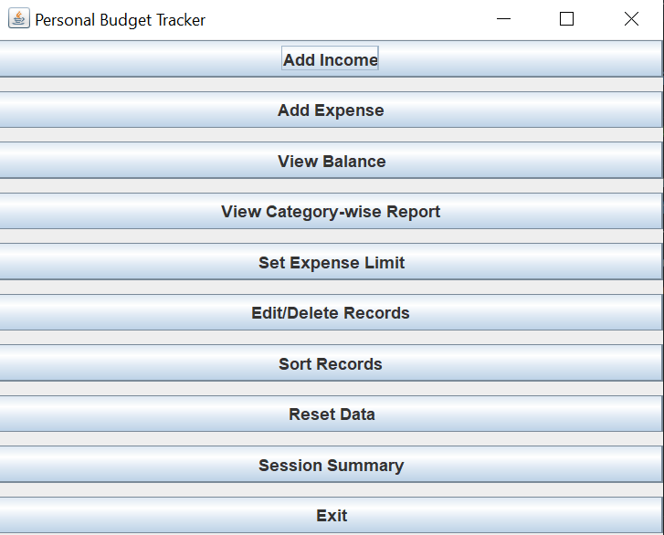
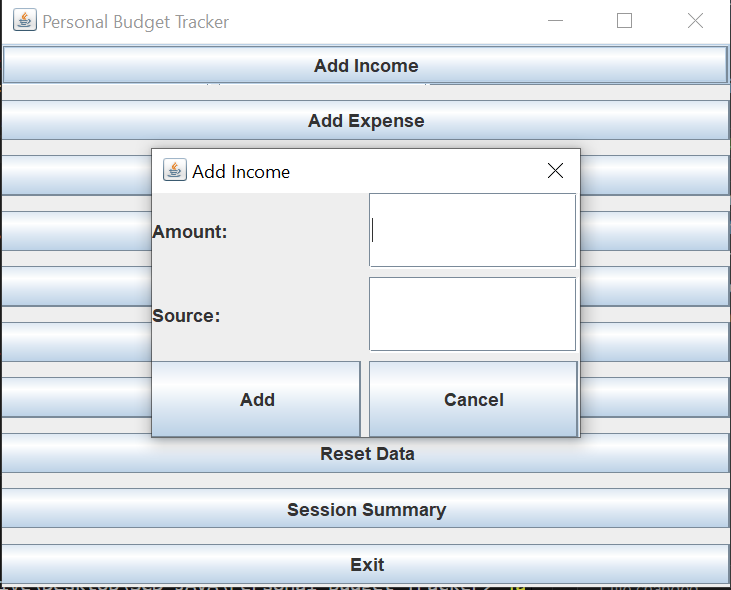
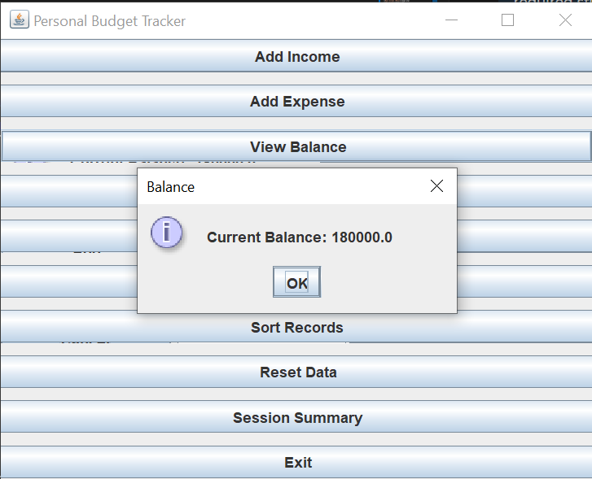
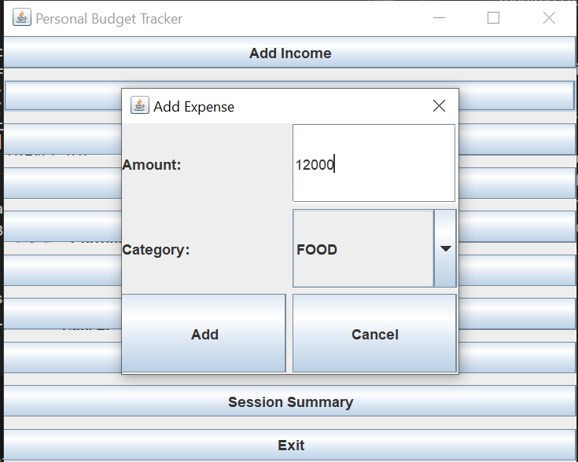
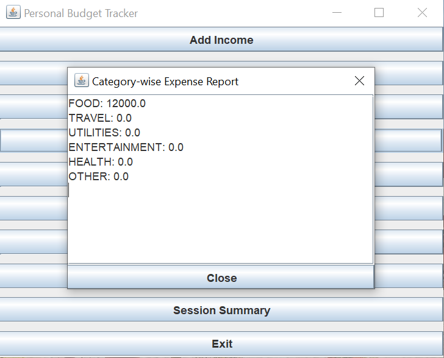
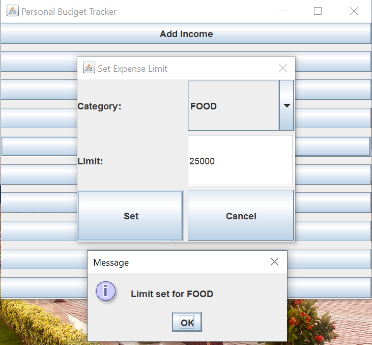
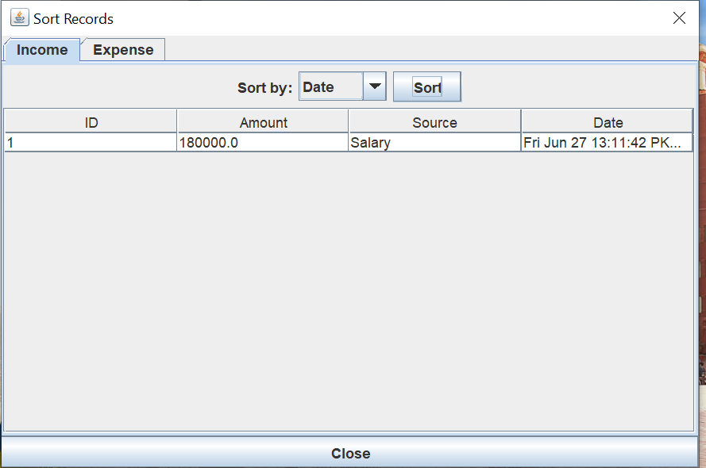
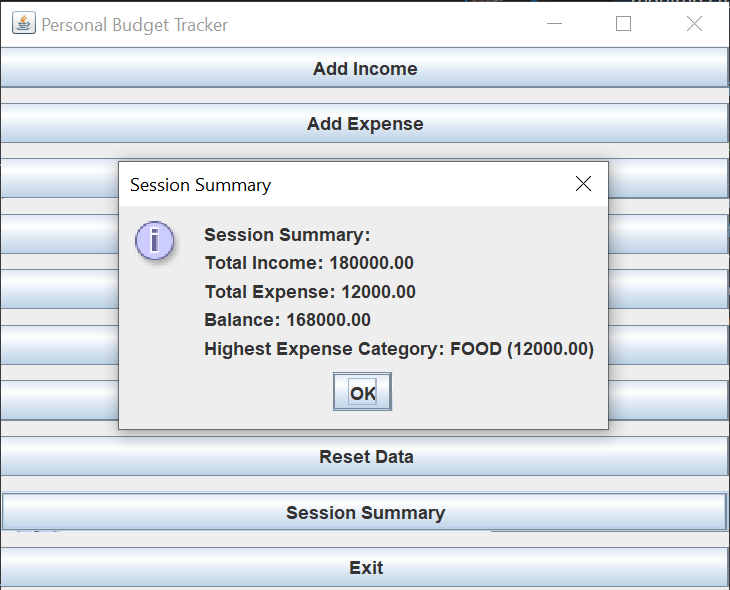

# Personal Budget Tracker

   **Github Link: https://github.com/Faseeh-Qureshi/Personal-Budget-Tracker**
   
## Overview
Personal Budget Tracker is a Java GUI-based application designed to help users manage their personal finances efficiently. The application allows users to record income and expenses, set spending limits, view balance and spending reports, and analyze their financial habits through an intuitive interface.

## Features
- Add, edit, and delete income and expense records
- Categorize expenses and set monthly limits for each category
- View summary reports and spending analysis
- Sort and filter transactions by date, category, or amount
- User-friendly graphical interface

## Technologies Used
- Java (JDK 8 or higher)
- Swing (Java GUI Framework)

## Project Structure
```
Main.java                  # Application entry point
controller/                # Controllers for handling user actions
model/                     # Data models (Expense, Income, Category, etc.)
view/                      # GUI components and dialogs
```

## How to Run
1. Ensure you have Java JDK 8 or higher installed.
2. Compile the project:
   ```
   javac Main.java controller/*.java model/*.java view/*.java
   ```
3. Run the application:
   ```
   java Main
   ```

## Screenshots of major workflows










## Author
- Name: Muahmmad Faseeh
- Email: L1F21BSSE0406

## License
This project is licensed under the MIT License. See the LICENSE file for details.
